# MACHINE LEARNING-BASED VISUAL TOOL FOR NEWS RELIABILITY ASSESSMENT

## TABLE OF CONTENTS

INTRODUCTION  
1. Overview  
2. Problem Statement  
3. Project Aims  
4. Scope and Expected Outcomes  
5. Structure of the Project Report  

CHAPTER 1. THEORETICAL BASIS AND TOOLS  
1.1. News Reliability Assessment and Fake News Detection  
1.2. Vietnamese Natural Language Processing  
1.3. Text Classification Pipeline  
1.4. TF-IDF Feature Extraction  
1.5. Machine Learning Algorithms  
1.6. Model Evaluation Metrics  
1.7. Explainability and Visual Analytics  
1.8. System Technologies  
1.9. Summary  

CHAPTER 2. SYSTEM ANALYSIS AND DESIGN  
2.1. System Overview  
2.2. Requirements Analysis  
2.3. User Requirements  
2.4. Functional Requirements  
2.5. Non-Functional Requirements  
2.6. Use Case Diagram  
2.7. Use Case Specifications  
2.8. Activity Diagram  
2.9. Sequence Diagram  
2.10. Class and Module Design  
2.11. Layered Architecture Design  
2.12. Data Processing Pipeline Design  
2.13. Database Design  
2.14. Deployment Design  
2.15. Feedback Loop Design  
2.16. Security and Reliability Considerations  
2.17. Summary  

CHAPTER 3. SETUP AND PRACTICAL RESULTS  
3.1. Development Environment  
3.2. Project Structure  
3.3. Dataset Preparation  
3.4. Model Training Implementation  
3.5. Model Evaluation Results  
3.6. Web Application Implementation  
3.7. Supabase Integration  
3.8. Testing and Verification  
3.9. Practical Demonstration Scenarios  
3.10. Discussion  
3.11. Summary  

CHAPTER 4. CONCLUSION AND FUTURE WORK  
4.1. Conclusion  
4.2. Achievements  
4.3. Limitations  
4.4. Future Work  
4.5. Final Remarks  

REFERENCES

---

## ABBREVIATIONS

| Abbreviation | Meaning |
|---|---|
| AI | Artificial Intelligence |
| API | Application Programming Interface |
| CSV | Comma-Separated Values |
| DB | Database |
| ERD | Entity Relationship Diagram |
| F1 | F1-score |
| FN | False Negative |
| FP | False Positive |
| HTML | HyperText Markup Language |
| JSON | JavaScript Object Notation |
| ML | Machine Learning |
| NLP | Natural Language Processing |
| NFR | Non-Functional Requirement |
| OCR | Optical Character Recognition |
| RLS | Row Level Security |
| ROC-AUC | Receiver Operating Characteristic - Area Under Curve |
| SDK | Software Development Kit |
| SQL | Structured Query Language |
| SVM | Support Vector Machine |
| TF-IDF | Term Frequency - Inverse Document Frequency |
| TN | True Negative |
| TP | True Positive |
| UI | User Interface |
| UML | Unified Modeling Language |
| URL | Uniform Resource Locator |
| UX | User Experience |
| VFND | Vietnamese Fake News Dataset |

---

## LIST OF FIGURES

Figure 1. Layered architecture of the system  
Figure 2. Use case diagram  
Figure 3. Activity diagram for text analysis  
Figure 4. Sequence diagram for prediction workflow  
Figure 5. Class and module diagram  
Figure 6. Training and evaluation pipeline  
Figure 7. Database entity relationship diagram  
Figure 8. Deployment view  
Figure 9. Feedback loop for model improvement  
Figure 10. Confusion matrix of Logistic Regression  
Figure 11. Confusion matrix of Linear SVM  
Figure 12. Confusion matrix of Random Forest  
Figure 13. Confusion matrix of Multinomial Naive Bayes  
Figure 14. Streamlit interface layout  
Figure 15. Result visualization dashboard  

---

## LIST OF TABLES

Table 1. Project scope and deliverables  
Table 2. User requirements  
Table 3. Functional requirements  
Table 4. Non-functional requirements  
Table 5. Use case list  
Table 6. UCS-01 Analyze text  
Table 7. UCS-02 Analyze URL  
Table 8. UCS-03 View explanation  
Table 9. UCS-04 Submit feedback  
Table 10. UCS-05 View history  
Table 11. UCS-06 Train and evaluate model  
Table 12. Module responsibilities  
Table 13. Dataset schema after normalization  
Table 14. Predictions table schema  
Table 15. Feedback table schema  
Table 16. Development tools  
Table 17. Dataset split information  
Table 18. Model comparison results  
Table 19. Testing checklist  
Table 20. Demonstration scenarios  

---

# INTRODUCTION

## 1. Overview

In the era of digital transformation, online news platforms and social media have become major sources of information for users. News articles, short posts, headlines, and forwarded messages can spread rapidly through online communities. This development creates both benefits and risks. On one hand, users can access information faster than ever before. On the other hand, unreliable content, fabricated stories, misleading headlines, emotional manipulation, and clickbait can also spread quickly and affect public perception.

Vietnamese users face the same problem when reading online news. A headline may look attractive but hide weak evidence. A short viral post may use emotional language, unverified claims, or exaggerated wording. In many situations, users need a quick tool that can support them in evaluating whether a piece of news content appears reliable or suspicious.

The project titled **Machine Learning-based Visual Tool for News Reliability Assessment** aims to build a practical web application that supports Vietnamese news reliability assessment using Natural Language Processing and Machine Learning. The application allows users to enter a news paragraph or a news URL, then returns a reliability prediction, risk score, suspicious keyword highlighting, token-level explanation, and analysis history. The tool is designed as a decision-support application, not as a replacement for professional fact-checking organizations.

The system follows a layered architecture. The presentation layer is implemented with Streamlit. The core processing layer performs text preprocessing, TF-IDF feature extraction, machine learning inference, risk scoring, and explainability. The data layer uses Supabase/PostgreSQL to store prediction history and user feedback. This separation helps the project remain clear, maintainable, and extensible.

## 2. Problem Statement

Fake news detection is a difficult task because the reliability of news depends on many factors: content, source credibility, writing style, factual evidence, publication history, and social context. A complete fact-checking system would need external evidence retrieval, source verification, and claim-level reasoning. Within the scope of a specialized undergraduate project, the project focuses on a practical and achievable subproblem: detecting reliability patterns in Vietnamese text using supervised machine learning and presenting the results visually.

The project addresses both social and technical problems.

From the social perspective, readers often do not have enough time to manually verify every piece of news content. A visual tool can help them identify suspicious linguistic signals and encourage more careful reading. The tool can also be used in learning environments to demonstrate how NLP and ML can support information verification.

From the technical perspective, Vietnamese text classification has several challenges:

- Vietnamese text contains accents and Unicode forms that need normalization.
- Public datasets may use different field names and label conventions.
- Short texts and headlines may not provide enough evidence for confident classification.
- The model should respond quickly enough for interactive web use.
- The system should explain predictions instead of only showing a label.
- Prediction results and user feedback should be stored for later analysis and retraining.

Therefore, the project is designed to combine a reproducible training pipeline, a trained baseline model, a visual Streamlit interface, and a Supabase feedback loop.

## 3. Project Aims

The main aims of the project are:

- To build a working web application for Vietnamese news reliability assessment.
- To design a modular NLP pipeline for cleaning, normalizing, and transforming text data.
- To train and compare classical machine learning models for binary text classification.
- To package the best model and integrate it into a Streamlit application.
- To visualize prediction results using risk score, probability chart, highlighted suspicious terms, and token-level explanation.
- To store prediction history and user feedback in Supabase/PostgreSQL.
- To provide a reproducible Google Colab notebook so the training process can be repeated.
- To organize the source code clearly enough for maintenance, academic evaluation, and future extension.

## 4. Scope and Expected Outcomes

The scope of this project is limited to binary news reliability assessment. The system predicts whether a text is likely to be reliable or unreliable based on linguistic patterns learned from data. It does not claim to prove whether every factual statement is true.

Table 1. Project scope and deliverables

| Item | Description | Status |
|---|---|---|
| Web application | Streamlit interface for input, analysis, visualization, history, and feedback | Completed |
| NLP pipeline | Text normalization, preprocessing, TF-IDF feature extraction, suspicious term detection | Completed |
| Machine learning models | Logistic Regression, Linear SVM, Random Forest, Multinomial Naive Bayes | Completed |
| Best model artifact | Serialized best model for app inference | Completed |
| Database integration | Supabase/PostgreSQL tables for predictions and feedback | Completed |
| Training notebook | Colab notebook for download, prepare, train, evaluate, and export | Completed |
| Evaluation reports | Model comparison, metrics, confusion matrices, metadata | Completed |
| Testing | Unit tests and artifact evaluation script | Completed |
| Future extension | Optional larger datasets, transformer models, evidence retrieval | Planned |

Expected outcomes include a stable web app, a trained model, evaluation results, a clean source structure, and project documents that demonstrate the complete workflow from data preparation to deployment-ready inference.

## 5. Structure of the Project Report

The report is organized into four chapters:

- **Chapter 1. Theoretical Basis and Tools** introduces fake news detection, Vietnamese NLP, TF-IDF, machine learning algorithms, evaluation metrics, explainability, Streamlit, Supabase, and supporting tools.
- **Chapter 2. System Analysis and Design** presents requirements, use cases, UML diagrams, layered architecture, data pipeline design, database design, deployment view, feedback loop, and security considerations.
- **Chapter 3. Setup and Practical Results** describes the implementation environment, project structure, dataset preparation, model training, evaluation results, web application, Supabase integration, testing, and demo scenarios.
- **Chapter 4. Conclusion and Future Work** summarizes achievements, limitations, future improvements, and final remarks.

---

# CHAPTER 1. THEORETICAL BASIS AND TOOLS

## 1.1. News Reliability Assessment and Fake News Detection

News reliability assessment is the process of estimating whether a piece of news content is trustworthy, suspicious, misleading, or unreliable. In this project, the task is simplified into a binary classification problem:

- `0 = reliable / real`
- `1 = unreliable / fake / clickbait`

This label convention is selected because the main dataset, VFND, follows a real/fake labeling scheme. The model learns linguistic patterns from labeled news content and predicts the likely class of new input text.

Fake news detection can be approached from several directions. Content-based methods analyze the text itself, including word choice, writing style, sentiment, punctuation, and topic signals. Source-based methods consider the publisher, author, domain, or social account. Propagation-based methods study how information spreads across social networks. Evidence-based methods compare claims with trusted external sources.

This project focuses mainly on content-based classification because it is practical for a student project and can be implemented with available Vietnamese text datasets. The tool also adds suspicious keyword highlighting to make the prediction easier to interpret.

## 1.2. Vietnamese Natural Language Processing

Natural Language Processing is a field of Artificial Intelligence that focuses on processing human language. For text classification, NLP converts raw text into structured numerical features that machine learning algorithms can process.

Vietnamese NLP has specific characteristics:

- Vietnamese uses Latin characters with diacritics, so Unicode normalization is important.
- Word boundaries can be ambiguous because a word may contain multiple syllables separated by spaces.
- Online news and social posts may contain URLs, emojis, punctuation noise, uppercase emphasis, and informal expressions.
- Clickbait or misleading Vietnamese content often uses emotional phrases, exaggerated claims, and unverified wording.

The preprocessing pipeline in this project is intentionally lightweight and reproducible. It includes Unicode normalization, URL removal, whitespace normalization, token extraction, stopword filtering, and suspicious term detection. This design is suitable for classical machine learning models and easy to explain during defense.

## 1.3. Text Classification Pipeline

Text classification is the task of assigning one or more labels to a text. A typical supervised text classification pipeline includes:

1. Collecting labeled text data.
2. Cleaning and normalizing raw text.
3. Splitting data into training, validation, and test sets.
4. Extracting numerical features from text.
5. Training candidate machine learning models.
6. Evaluating models using objective metrics.
7. Selecting and exporting the best model.
8. Loading the model in an application for inference.

In this project, the pipeline is implemented through Python scripts and a Google Colab notebook. The best model is saved as a joblib artifact, then loaded by the Streamlit application.

## 1.4. TF-IDF Feature Extraction

TF-IDF stands for Term Frequency - Inverse Document Frequency. It is a classical method for representing documents as numerical vectors.

Term Frequency measures how often a term appears in a document. Inverse Document Frequency reduces the weight of terms that appear in many documents and increases the weight of terms that are more discriminative. As a result, common terms receive lower weights while class-specific terms become more influential.

In this project, `TfidfVectorizer` from scikit-learn is used with unigram and bigram features. The vectorizer transforms Vietnamese news text into a sparse matrix. Each row represents a document and each column represents a token or token pair.

TF-IDF is selected for several reasons:

- It trains quickly on small and medium datasets.
- It works well with linear classifiers.
- It is suitable for high-dimensional sparse text features.
- It is easier to explain than deep learning embeddings.
- It supports token-level contribution analysis for linear models.

## 1.5. Machine Learning Algorithms

The project trains and compares four baseline models. Using multiple models is important because it proves that the final selection is based on evaluation, not assumption.

### 1.5.1. Logistic Regression

Logistic Regression is a linear classification algorithm. It estimates the probability that a sample belongs to a class using a logistic function. In text classification, Logistic Regression is commonly used because it performs well on sparse TF-IDF features and provides interpretable coefficients.

### 1.5.2. Linear Support Vector Machine

Linear SVM attempts to find a hyperplane that separates classes with a large margin. It is a strong baseline for text classification because sparse TF-IDF features are often linearly separable enough for good performance. In this project, Linear SVM becomes the best-performing model.

### 1.5.3. Random Forest

Random Forest is an ensemble method that builds multiple decision trees and combines their outputs. It can capture non-linear relationships, but it may not always outperform linear models on sparse text features. It is included to compare a tree-based approach with linear baselines.

### 1.5.4. Multinomial Naive Bayes

Multinomial Naive Bayes is a probabilistic classifier often used in text classification. It assumes conditional independence between features. Although this assumption is simplified, the model is fast, stable, and useful as a baseline.

## 1.6. Model Evaluation Metrics

The project uses several metrics to evaluate model quality:

- **Accuracy** measures the proportion of correct predictions.
- **Precision** measures how many predicted positive samples are actually positive.
- **Recall** measures how many actual positive samples are correctly detected.
- **F1-score** balances precision and recall.
- **Macro average** treats each class equally.
- **Weighted average** accounts for class distribution.
- **ROC-AUC** measures the ranking ability of the model across thresholds.
- **Confusion matrix** shows true positives, true negatives, false positives, and false negatives.

Because the project is a binary classification problem with balanced labels, accuracy and F1 macro are both meaningful. The final model is selected mainly using validation F1 macro, then evaluated on the test set.

## 1.7. Explainability and Visual Analytics

A reliability assessment tool should not only output a label. Users need to understand why the system considers a text suspicious or reliable. Therefore, the project provides several visual explanation components:

- Risk score showing the estimated level of unreliability.
- Probability-like chart comparing reliable and unreliable scores.
- Highlighted suspicious terms in the input text.
- Token contribution table for linear models.
- Text statistics such as word count, sentence count, uppercase ratio, and punctuation count.

For linear models, token contributions are computed from TF-IDF values and classifier weights. Positive contributions push the prediction toward the unreliable class, while negative contributions push it toward the reliable class. This makes the model more transparent during demonstration.

## 1.8. System Technologies

### 1.8.1. Python

Python is used as the main programming language. It is suitable for machine learning projects because it has strong libraries for data processing, model training, and web-based data applications.

### 1.8.2. Streamlit

Streamlit is used to build the web interface. It allows Python developers to create interactive web applications quickly. In this project, Streamlit handles input forms, model selection, charts, highlighted text, tables, history views, and feedback forms.

The application uses `st.cache_resource` to cache loaded models. This prevents the model from being reloaded on every interaction and improves response time.

### 1.8.3. scikit-learn

scikit-learn is used for TF-IDF feature extraction, model training, evaluation metrics, pipeline construction, and model serialization. The final model is stored using joblib.

### 1.8.4. Supabase and PostgreSQL

Supabase provides a hosted PostgreSQL database and SDKs. In this project, Supabase stores prediction history and user feedback. PostgreSQL is suitable because the data is structured and can be queried later for analysis or retraining.

### 1.8.5. Google Colab

Google Colab is used as a reproducible training environment. The notebook in the project allows the whole training workflow to be executed from dataset download to model export.

### 1.8.6. GitHub

GitHub is used for source code management and submission. A clean repository structure helps evaluators inspect the project more easily.

## 1.9. Summary

This chapter presented the theoretical foundation and tools used in the project. The core idea is to combine Vietnamese NLP, TF-IDF feature extraction, classical machine learning, visual explanation, Streamlit UI, and Supabase storage into a complete web-based system.

---

# CHAPTER 2. SYSTEM ANALYSIS AND DESIGN

## 2.1. System Overview

The system is a web-based application for analyzing Vietnamese news text. A user enters text or a supported URL. The system preprocesses the input, runs machine learning inference, calculates risk score, highlights suspicious terms, displays explanation, saves the prediction, and optionally collects user feedback.

The design follows a layered architecture:

- Presentation layer: Streamlit user interface.
- Core engine layer: NLP preprocessing, feature extraction, model inference, risk scoring, and explainability.
- Data layer: Supabase/PostgreSQL and local fallback storage.
- Model artifact layer: trained model and metadata.

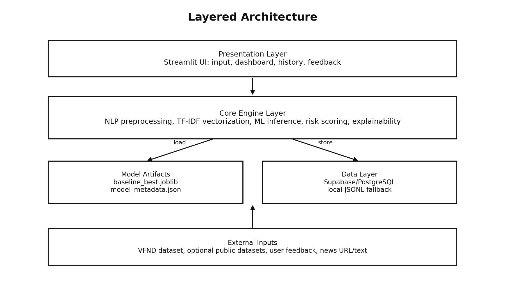

Figure 1. Layered architecture of the system

The layered design makes the project easier to maintain. UI logic is separated from ML logic, and database access is wrapped in a dedicated client.

## 2.2. Requirements Analysis

The project requirements are derived from the objective of building a practical AI/NLP product for a specialized software engineering project. The system must demonstrate both machine learning capability and software engineering quality.

The main requirement groups are:

- User interaction requirements.
- NLP and ML processing requirements.
- Visualization requirements.
- Storage and feedback requirements.
- Reproducibility requirements.
- Security and reliability requirements.

## 2.3. User Requirements

Table 2. User requirements

| ID | Requirement | Description |
|---|---|---|
| UR-01 | Simple input | Users can paste news text directly into the application. |
| UR-02 | URL analysis | Users can provide a supported URL for automatic content extraction. |
| UR-03 | Clear result | Users can see whether the content is reliable or unreliable. |
| UR-04 | Visual explanation | Users can see risk score, probability chart, suspicious terms, and token explanation. |
| UR-05 | History | Users can review recent analysis results. |
| UR-06 | Feedback | Users can mark whether the system prediction is correct. |
| UR-07 | Fast response | Analysis should be fast enough for live demonstration. |
| UR-08 | Offline fallback | The application should still be demoable if cloud database is unavailable. |

## 2.4. Functional Requirements

Table 3. Functional requirements

| ID | Requirement | Description |
|---|---|---|
| FR-01 | Text input | The system allows users to paste Vietnamese news text. |
| FR-02 | URL input | The system allows users to enter a supported news URL. |
| FR-03 | Input validation | The system checks that input text is not empty and has enough content. |
| FR-04 | Text preprocessing | The system normalizes and cleans input text before inference. |
| FR-05 | Model selection | The system can load the best model artifact for prediction. |
| FR-06 | Prediction | The system predicts reliable or unreliable label. |
| FR-07 | Risk score | The system calculates a final risk score. |
| FR-08 | Suspicious terms | The system detects and highlights suspicious expressions. |
| FR-09 | Token explanation | The system displays terms that influence model output. |
| FR-10 | History storage | The system stores prediction records in Supabase or local fallback. |
| FR-11 | Feedback collection | The system stores user feedback for future retraining. |
| FR-12 | Model training | The project provides scripts and notebook to train baseline models. |
| FR-13 | Model evaluation | The project generates metrics and confusion matrices. |
| FR-14 | Artifact verification | The project checks that required artifacts exist before demo. |

## 2.5. Non-Functional Requirements

Table 4. Non-functional requirements

| ID | Requirement | Description |
|---|---|---|
| NFR-01 | Performance | Model inference should return quickly for interactive use. |
| NFR-02 | Usability | The UI should be simple, readable, and suitable for live demo. |
| NFR-03 | Maintainability | The source code should be separated into clear modules. |
| NFR-04 | Reproducibility | Training and evaluation should be repeatable from scripts or notebook. |
| NFR-05 | Security | Secrets are stored in environment variables and not committed to GitHub. |
| NFR-06 | Reliability | The application uses local fallback if Supabase is unavailable. |
| NFR-07 | Extensibility | New datasets and models can be added without rewriting the app. |
| NFR-08 | Explainability | The result should include explanations instead of only a label. |
| NFR-09 | Portability | The app should run locally and can be deployed to a cloud environment. |

## 2.6. Use Case Diagram

The system has two main actor groups:

- **General User**: enters text or URL, views analysis result, checks explanation, views history, and submits feedback.
- **Developer/Researcher**: prepares data, trains models, evaluates metrics, exports artifacts, and maintains the application.

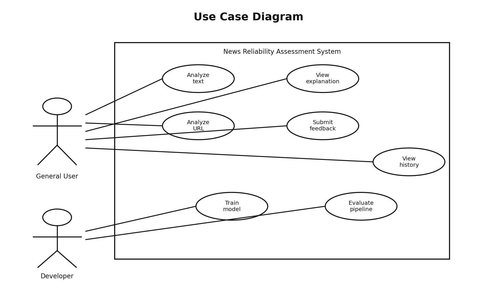

Figure 2. Use case diagram

Table 5. Use case list

| ID | Use Case | Actor | Description |
|---|---|---|---|
| UCS-01 | Analyze text | General User | Analyze pasted Vietnamese news text. |
| UCS-02 | Analyze URL | General User | Extract and analyze article content from a supported URL. |
| UCS-03 | View explanation | General User | View risk score, suspicious terms, and token explanation. |
| UCS-04 | Submit feedback | General User | Submit whether the prediction is correct. |
| UCS-05 | View history | General User | View recent prediction records. |
| UCS-06 | Train and evaluate model | Developer | Run dataset preparation, model training, and evaluation. |

## 2.7. Use Case Specifications

Table 6. UCS-01 Analyze text

| Field | Description |
|---|---|
| Use case name | Analyze text |
| Actor | General User |
| Description | The user pastes a news paragraph into the text area and requests analysis. |
| Precondition | The application is running and the input text is not empty. |
| Main flow | User selects text mode, enters text, clicks analyze, system preprocesses text, loads model, predicts label, calculates risk score, displays result, stores prediction. |
| Alternative flow | If the text is too short, the system asks the user to provide more content. If Supabase fails, the result is stored locally. |
| Post-condition | Prediction result and explanation are displayed; a prediction record is saved. |

Table 7. UCS-02 Analyze URL

| Field | Description |
|---|---|
| Use case name | Analyze URL |
| Actor | General User |
| Description | The user enters a supported news URL. The system extracts article text and analyzes it. |
| Precondition | URL mode is enabled and the domain is allowed. |
| Main flow | User enters URL, system validates domain, fetches HTML, extracts text, runs the same analysis pipeline as text mode, displays result, saves prediction. |
| Alternative flow | If the domain is not allowed or extraction fails, the system shows an error and does not analyze unsafe content. |
| Post-condition | Extracted text and prediction result are displayed if extraction succeeds. |

Table 8. UCS-03 View explanation

| Field | Description |
|---|---|
| Use case name | View explanation |
| Actor | General User |
| Description | The user reviews visual explanation after a prediction. |
| Precondition | A prediction has been completed. |
| Main flow | System displays label, confidence, final risk score, model risk, lexical risk, suspicious terms, highlighted text, token explanation, and text statistics. |
| Alternative flow | If the selected model does not support linear coefficients, the system displays important TF-IDF tokens as a fallback. |
| Post-condition | User understands the main signals behind the prediction. |

Table 9. UCS-04 Submit feedback

| Field | Description |
|---|---|
| Use case name | Submit feedback |
| Actor | General User |
| Description | The user marks whether the prediction is correct, incorrect, or uncertain. |
| Precondition | A prediction record exists in the current session. |
| Main flow | User selects a feedback option, optionally enters a comment, submits feedback, system stores the feedback in Supabase. |
| Alternative flow | If Supabase is unavailable, the feedback is stored in local fallback storage. |
| Post-condition | Feedback is available for later review and retraining. |

Table 10. UCS-05 View history

| Field | Description |
|---|---|
| Use case name | View history |
| Actor | General User |
| Description | The user opens the history tab to view recent prediction records. |
| Precondition | Supabase or local fallback contains prediction records. |
| Main flow | User opens history tab, system queries recent predictions, displays model name, label, risk score, confidence, and creation time. |
| Alternative flow | If no history exists, the system shows an empty state. |
| Post-condition | User can verify that predictions are stored successfully. |

Table 11. UCS-06 Train and evaluate model

| Field | Description |
|---|---|
| Use case name | Train and evaluate model |
| Actor | Developer/Researcher |
| Description | The developer runs the full data and model pipeline. |
| Precondition | Python environment and dependencies are installed. |
| Main flow | Run dataset download, prepare data, train baselines, compare metrics, export best model, run artifact evaluation. |
| Alternative flow | If a dataset source is unavailable, the system uses manual dataset instructions and existing prepared data when available. |
| Post-condition | Model artifact, metadata, metrics, and figures are generated. |

## 2.8. Activity Diagram

The activity diagram describes the main text analysis workflow from user input to result visualization and storage.

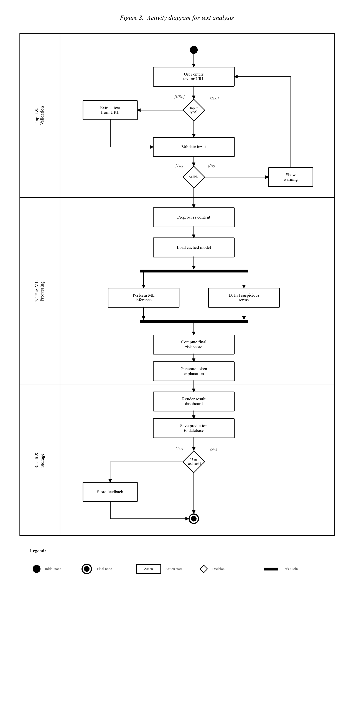

Figure 3. Activity diagram for text analysis

The process begins when the user enters text or a URL. The system validates the input, preprocesses the content, loads the cached model, performs inference, detects suspicious terms, computes final risk score, renders the dashboard, saves the prediction, and optionally collects feedback.

## 2.9. Sequence Diagram

The sequence diagram shows the interaction among the user, Streamlit interface, core engine, model artifact, and Supabase.

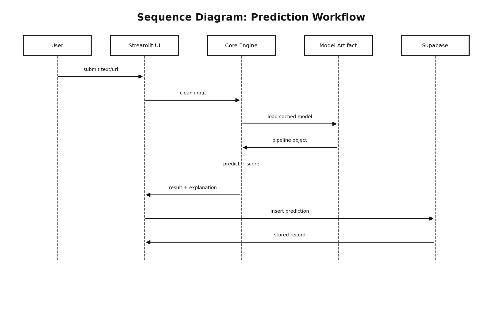

Figure 4. Sequence diagram for prediction workflow

The Streamlit UI receives user input and forwards the cleaned text to the core engine. The core engine loads the model artifact, performs prediction, generates explanation, returns the result to the UI, and stores the prediction record in Supabase.

## 2.10. Class and Module Design

The project is organized by module responsibilities rather than a large monolithic script.

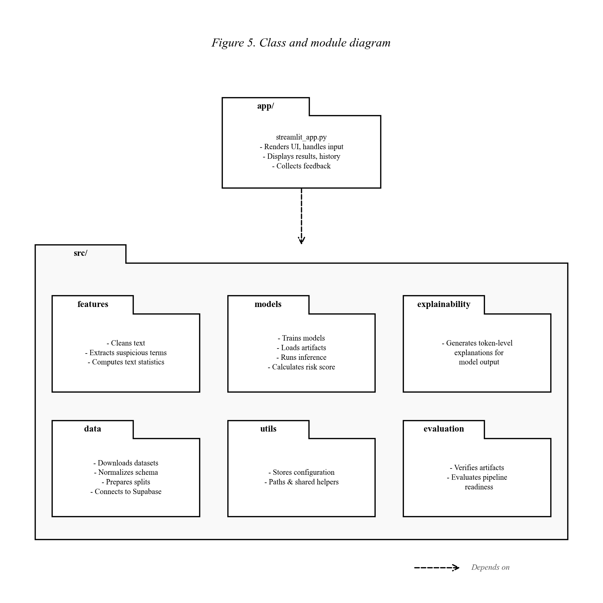

Figure 5. Class and module diagram

Table 12. Module responsibilities

| Module | Responsibility |
|---|---|
| `app/streamlit_app.py` | Renders UI, handles input, displays results, history, and feedback. |
| `src/data` | Downloads datasets, normalizes schema, prepares splits, connects to Supabase. |
| `src/features` | Cleans text, extracts suspicious terms, computes text statistics. |
| `src/models` | Trains models, loads artifacts, runs inference, calculates risk score. |
| `src/explainability` | Generates token-level explanations for model output. |
| `src/evaluation` | Verifies artifacts and evaluates pipeline readiness. |
| `src/utils` | Stores configuration, paths, and shared helpers. |
| `scripts` | Provides command-line entry points for pipeline execution. |
| `notebooks` | Provides Colab training workflow. |
| `reports` | Stores metrics, dataset profile, figures, and evaluation outputs. |

## 2.11. Layered Architecture Design

The layered architecture is selected to separate responsibilities clearly:

- The UI layer should not contain training logic.
- The model layer should not depend on Streamlit layout details.
- The data layer should hide Supabase-specific operations behind a client class.
- The evaluation layer should verify artifacts independently from the UI.

This design supports future upgrades. For example, a PhoBERT model can replace the current TF-IDF pipeline if it exposes a compatible inference interface. A new database table can be added without rewriting the model code.

## 2.12. Data Processing Pipeline Design

The training pipeline converts raw dataset files into model artifacts.

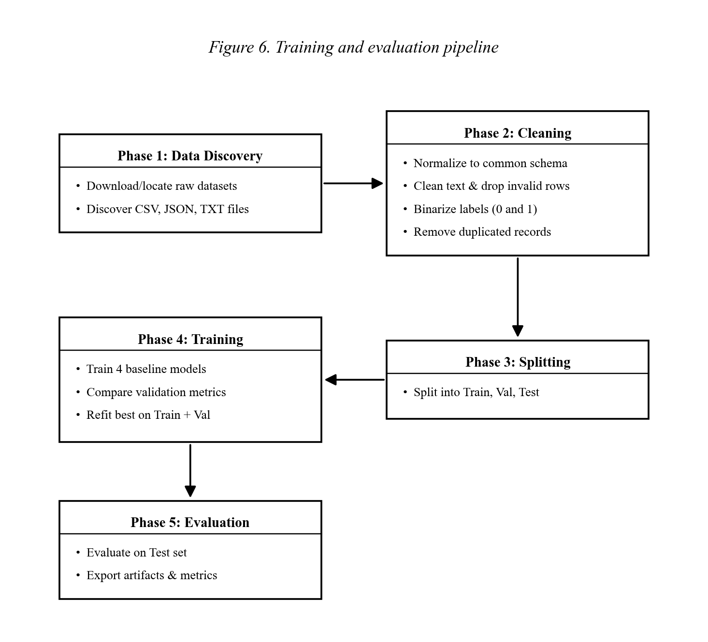

Figure 6. Training and evaluation pipeline

The pipeline includes:

1. Download or locate raw dataset files.
2. Discover CSV, JSON, and TXT files.
3. Normalize all records into a common schema.
4. Clean text and remove invalid rows.
5. Normalize labels into `0` and `1`.
6. Remove duplicates.
7. Split into train, validation, and test sets.
8. Train four baseline models.
9. Compare validation metrics.
10. Refit the best model on train plus validation data.
11. Evaluate the final model on the test set.
12. Export model artifact, metadata, metrics, and figures.

Table 13. Dataset schema after normalization

| Column | Description |
|---|---|
| `id` | Internal sample identifier |
| `source_dataset` | Dataset source name |
| `source_type` | Source type such as CSV, JSON, or manual source |
| `title` | News title if available |
| `content` | Main article content if available |
| `text` | Final text used for training and inference |
| `label` | Normalized binary label |
| `url` | Original URL if available |
| `published_at` | Publication time if available |

## 2.13. Database Design

The database contains two main tables: `predictions` and `feedback`.

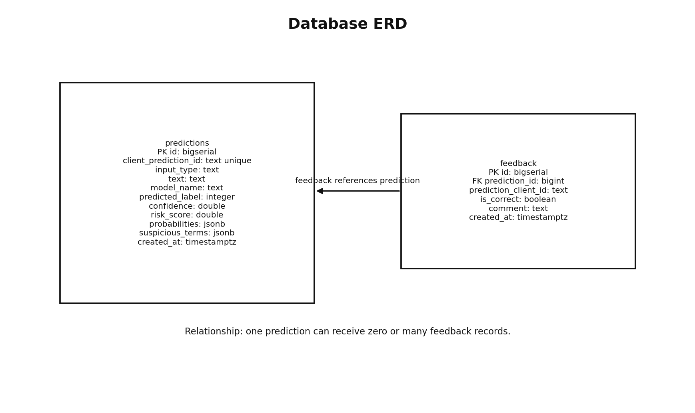

Figure 7. Database entity relationship diagram

### 2.13.1. Predictions Table

Table 14. Predictions table schema

| No. | Column | Type | Constraints / Notes |
|---:|---|---|---|
| 1 | `id` | bigserial | Primary key |
| 2 | `client_prediction_id` | text | Unique client-side prediction identifier |
| 3 | `input_type` | text | `text` or `url` |
| 4 | `text` | text | Cleaned input content |
| 5 | `model_name` | text | Selected model name |
| 6 | `predicted_label` | integer | `0` or `1` |
| 7 | `label_name` | text | `reliable` or `unreliable` |
| 8 | `confidence` | double precision | Confidence score |
| 9 | `risk_score` | double precision | Final risk score |
| 10 | `lexical_risk_score` | double precision | Rule-based risk component |
| 11 | `probabilities` | jsonb | Final probability-like scores |
| 12 | `model_probabilities` | jsonb | Raw ML probability or score mapping |
| 13 | `suspicious_terms` | jsonb | Detected suspicious expressions |
| 14 | `explanation` | text | Summary explanation |
| 15 | `created_at` | timestamptz | Creation timestamp |

### 2.13.2. Feedback Table

Table 15. Feedback table schema

| No. | Column | Type | Constraints / Notes |
|---:|---|---|---|
| 1 | `id` | bigserial | Primary key |
| 2 | `prediction_id` | bigint | Optional foreign key to `predictions.id` |
| 3 | `prediction_client_id` | text | Client-side prediction reference |
| 4 | `is_correct` | boolean | Whether the prediction is correct |
| 5 | `comment` | text | Optional user comment |
| 6 | `created_at` | timestamptz | Creation timestamp |

The `predictions` table records every analysis result. The `feedback` table stores user judgments. The two tables support a feedback loop for future retraining.

## 2.14. Deployment Design

The current project can run locally and can be deployed later to a cloud environment.

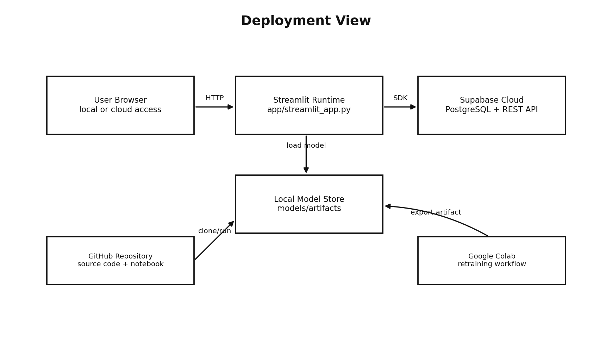

Figure 8. Deployment view

The browser accesses the Streamlit runtime through HTTP. The Streamlit app loads the local model artifact and communicates with Supabase through the SDK. The code and notebook are stored in GitHub, while retraining can be executed in Google Colab.

## 2.15. Feedback Loop Design

The feedback loop is an important part of the project because it shows how the system can improve over time.

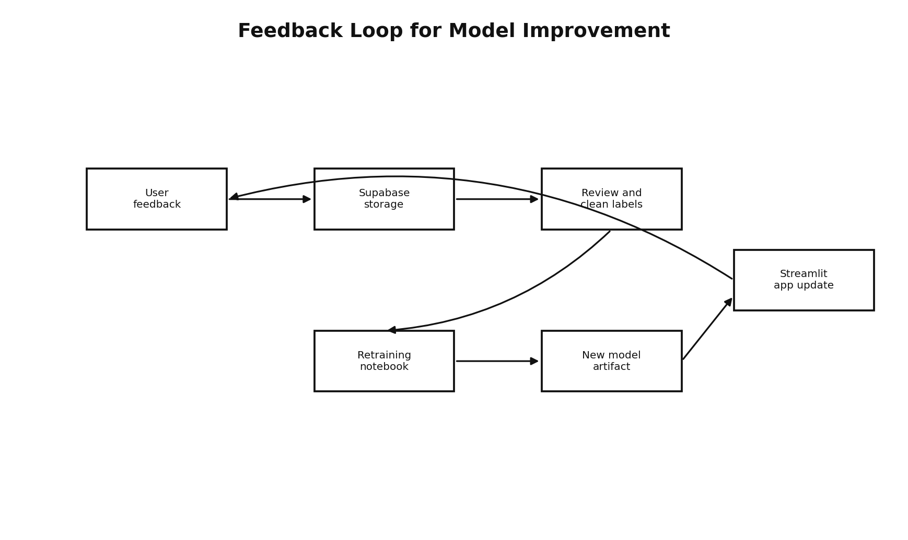

Figure 9. Feedback loop for model improvement

The workflow is:

1. User submits feedback after a prediction.
2. Feedback is stored in Supabase.
3. Developer reviews and cleans feedback records.
4. Valid feedback becomes additional labeled data.
5. Colab notebook retrains the model.
6. A new model artifact is exported.
7. Streamlit app uses the updated artifact.

## 2.16. Security and Reliability Considerations

The project includes several security and reliability considerations:

- Supabase credentials are loaded from environment variables.
- Secret keys and database passwords are excluded from GitHub.
- URL analysis uses an allowed-domain mechanism to reduce unsafe URL fetching.
- Supabase Row Level Security policies can be applied to control access.
- If Supabase is not configured or temporarily unavailable, the system stores records in a local JSONL fallback file.
- Model loading is cached to reduce repeated disk reads and improve performance.
- Artifact evaluation checks that required model and report files exist before demo.

## 2.17. Summary

This chapter analyzed requirements and presented the system design. The project includes UML-style diagrams, layered architecture, training pipeline, database schema, deployment view, and feedback loop. These design artifacts demonstrate that the project is not only a machine learning script, but a complete software product.

---

# CHAPTER 3. SETUP AND PRACTICAL RESULTS

## 3.1. Development Environment

The project is implemented in Python and can be run locally or in Google Colab.

Table 16. Development tools

| Tool / Technology | Purpose |
|---|---|
| Python 3.11 | Main programming language |
| pandas | Dataset loading and preprocessing |
| NumPy | Numerical processing |
| scikit-learn | TF-IDF, ML models, metrics, pipelines |
| joblib | Model serialization |
| matplotlib | Confusion matrix and report figure generation |
| Streamlit | Web application interface |
| BeautifulSoup | Basic HTML content extraction |
| python-dotenv | Environment variable loading |
| Supabase SDK | Database communication |
| PostgreSQL | Cloud database storage |
| pytest | Unit testing |
| Google Colab | Reproducible training notebook |
| GitHub | Source code management |

Basic setup commands:

```bash
python3 -m venv .venv
. .venv/bin/activate
python3 -m pip install -r requirements.txt
```

Run the application:

```bash
streamlit run app/streamlit_app.py
```

Run the full pipeline:

```bash
python3 scripts/run_pipeline.py
```

Run tests:

```bash
python3 -m pytest -q
```

## 3.2. Project Structure

The project structure is organized to match a layered architecture:

```text
app/                 Streamlit UI
src/data/            Dataset pipeline and Supabase client
src/features/        Text preprocessing and suspicious term rules
src/models/          Training, inference, risk scoring
src/explainability/  Token-level explanation
src/evaluation/      Artifact verification
src/utils/           Shared configuration
scripts/             Command-line pipeline scripts
notebooks/           Colab training notebook
models/              Best model artifact and metadata
reports/             Metrics, dataset profile, figures
tests/               Unit tests
```

This structure helps evaluators locate the source code quickly. It also supports maintenance because each module has a clear responsibility.

## 3.3. Dataset Preparation

The primary dataset is VFND, a Vietnamese fake news dataset containing real and fake news samples. The project uses VFND as the default training source because it follows the target task closely and uses a real/fake label convention.

The label convention is:

- `0 = reliable / real`
- `1 = unreliable / fake / clickbait`

The dataset preparation process includes:

- Reading raw files from available dataset folders.
- Normalizing different source schemas.
- Combining title and content when necessary.
- Cleaning whitespace and invalid text.
- Removing duplicate samples.
- Normalizing labels.
- Creating train, validation, and test splits.

Table 17. Dataset split information

| Split | Number of samples |
|---|---:|
| Train | 350 |
| Validation | 75 |
| Test | 75 |
| Total | 500 |

Label distribution:

- Reliable / real (`0`): 251 samples.
- Unreliable / fake / clickbait (`1`): 249 samples.

The dataset is balanced enough for baseline model evaluation. This balance is useful because accuracy and F1 macro are both meaningful.

## 3.4. Model Training Implementation

The training script builds four machine learning pipelines:

- TF-IDF + Logistic Regression.
- TF-IDF + Linear SVM.
- TF-IDF + Random Forest.
- TF-IDF + Multinomial Naive Bayes.

Each pipeline contains text vectorization and a classifier. The project compares the models using validation metrics. The best model is selected by validation F1 macro, then retrained on train plus validation data and evaluated on the held-out test set.

The training process exports:

- `models/artifacts/baseline_best.joblib`
- `models/reports/model_metadata.json`
- `reports/metrics_baseline.json`
- `reports/model_comparison.md`
- `reports/figures/confusion_matrix_*.png`

The Google Colab notebook provides the same workflow so the training process can be repeated without depending only on a local machine.

## 3.5. Model Evaluation Results

Table 18. Model comparison results

| Model | Val Accuracy | Val F1 Macro | Test Accuracy | Test F1 Macro | Test ROC-AUC |
|---|---:|---:|---:|---:|---:|
| Logistic Regression | 0.9200 | 0.9196 | 0.8933 | 0.8929 | 0.9772 |
| Linear SVM | 0.9467 | 0.9466 | 0.9067 | 0.9064 | 0.9879 |
| Random Forest | 0.9200 | 0.9196 | 0.8933 | 0.8929 | 0.9851 |
| Multinomial Naive Bayes | 0.9067 | 0.9061 | 0.8933 | 0.8929 | 0.9744 |

The best model is Linear SVM. After refitting on train plus validation data, the final test results are:

- Accuracy: `0.9200`
- F1 macro: `0.9199`
- ROC-AUC: `0.9915`

These results show that a classical TF-IDF + Linear SVM baseline is strong for this dataset. The result is also suitable for a student project because it is reproducible, fast, and explainable.

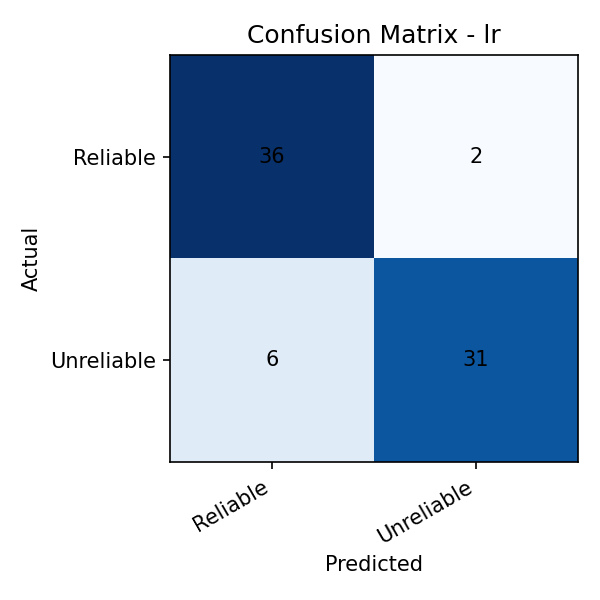

Figure 10. Confusion matrix of Logistic Regression

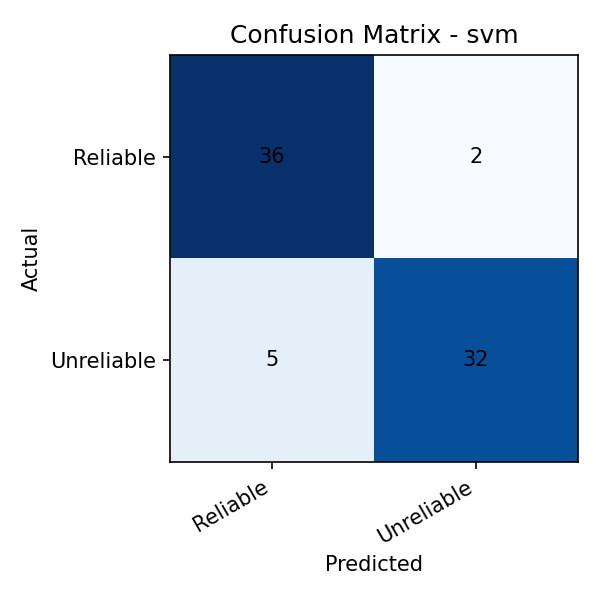

Figure 11. Confusion matrix of Linear SVM

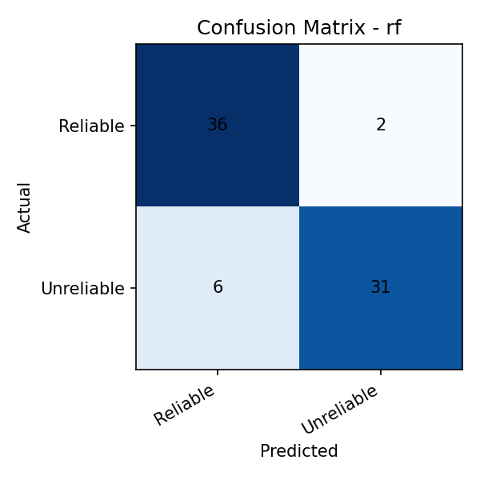

Figure 12. Confusion matrix of Random Forest


Figure 13. Confusion matrix of Multinomial Naive Bayes

## 3.6. Web Application Implementation

The Streamlit application provides the main user-facing interface. The interface is written in English to match the slide deck and report language, while the analyzed content remains Vietnamese because the dataset and model target Vietnamese news text.

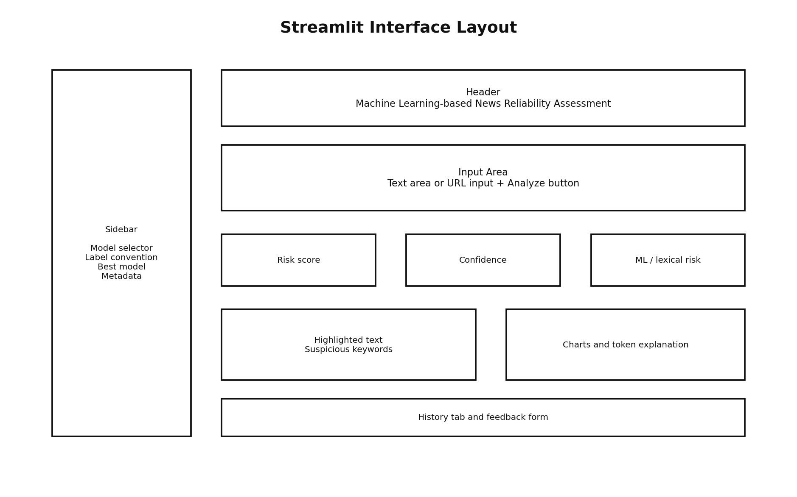

Figure 14. Streamlit interface layout

The interface includes:

- Sidebar for model information and label convention.
- Input area for text or URL.
- Analyze button.
- Project dashboard with model benchmark, workflow coverage, and confusion matrix view.
- Prediction result section.
- Assessment summary with risk band.
- Explanation panels for reading the result.
- Risk score and confidence metrics.
- Probability and risk visualization.
- Highlighted text preview.
- Suspicious term table.
- Token explanation table.
- Demo sample buttons for trusted and suspicious text.
- Downloadable case report for each analysis.
- History tab.
- Feedback form.

The application uses model caching so the model artifact is loaded once and reused. This improves performance during live demonstration.

The dashboard and case-report export were added after benchmarking similar systems such as Full Fact AI, NewsGuard, Google Fact Check tools, and ClaimBuster. These systems show that reliability tools should provide more than a raw score: they should include visible ratings, supporting criteria, review history, and report-like outputs. The project implements these ideas within the scope of a student NLP/ML application.

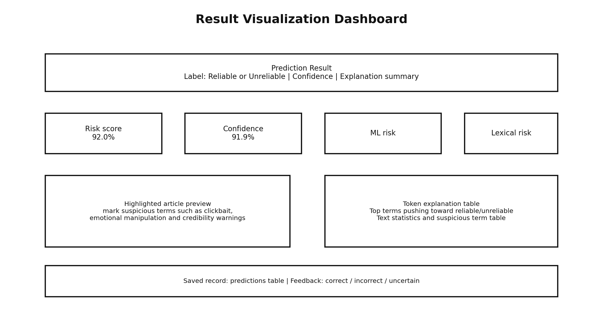

Figure 15. Result visualization dashboard

### 3.6.1. Text Mode

In text mode, the user pastes a Vietnamese news paragraph. The system validates the text and sends it to the model pipeline. The result is displayed immediately. For defense demonstration, the application also provides two controlled samples: one trusted-style paragraph and one suspicious/clickbait-style paragraph. These samples make the demo stable and avoid depending on external fake-news websites.

### 3.6.2. URL Mode

In URL mode, the user provides a news URL. The system validates the domain, fetches the page, extracts text content, and runs the same prediction workflow. This feature is designed as an advanced function and can be restricted by allowed domains.

### 3.6.3. Risk Score

The final risk score combines model output and lexical risk. Model output captures patterns learned from data. Lexical risk captures suspicious expressions such as:

- `sốc`
- `không thể tin`
- `tin đồn`
- `chưa kiểm chứng`
- `lan truyền`
- `gây hoang mang`

The risk score should be interpreted as a decision-support score, not as absolute truth.

The application explicitly explains this interpretation in the result page. The "Why this result?" section separates ML signal, lexical signal, and final risk. The "How to read this result" section reminds users that confidence and risk score support screening, but do not prove factual truth.

### 3.6.4. Token Explanation

For linear models, token contribution is calculated using TF-IDF values and model coefficients. This helps users see which terms push the prediction toward reliable or unreliable.

## 3.7. Supabase Integration

The Supabase integration is implemented through a dedicated client class. The client provides methods for:

- inserting prediction records;
- inserting feedback records;
- listing recent predictions.

When Supabase credentials are configured, the app writes to Supabase/PostgreSQL. If the cloud database is unavailable, the app stores records in a local JSONL fallback file. This is important for demo reliability because the application remains usable even if the network is unstable.

## 3.8. Testing and Verification

The project includes unit tests and artifact verification.

Table 19. Testing checklist

| Verification item | Status | Description |
|---|---|---|
| Unit tests | Passed | Core data, preprocessing, inference, and script behavior are tested. |
| Dataset preparation | Passed | Raw data can be normalized and split. |
| Baseline training | Passed | Model artifact and metrics can be generated. |
| Artifact evaluation | Passed | Required model and report files exist. |
| Notebook validation | Passed | Colab notebook is valid JSON. |
| Streamlit HTTP check | Passed | The app responds successfully on local port. |
| Supabase SDK connection | Passed | The app can connect and read recent predictions. |
| Secret scan | Passed | No real Supabase keys are found outside `.env`. |

Current unit test result:

```text
12 passed
```

Current artifact evaluation result:

```json
{
  "ok": true,
  "missing_files": []
}
```

## 3.9. Practical Demonstration Scenarios

Table 20. Demonstration scenarios

| Scenario | Input | Expected result | Purpose |
|---|---|---|---|
| Reliable news | A neutral news paragraph from a credible writing style | Lower risk score and reliable label | Demonstrate normal analysis workflow |
| Suspicious/clickbait text | Text containing emotional and unverified phrases | Higher risk score and suspicious term highlights | Demonstrate lexical risk and visualization |
| URL extraction | A reliable article URL or fact-check article URL from allowed domains | Extracted content appears before analysis | Demonstrate URL workflow and explain that fact-check articles may contain fake-claim terms |
| History view | Open history tab after analysis | Recent prediction appears | Demonstrate Supabase storage |
| Feedback | Submit correct/incorrect/uncertain feedback | Feedback saved successfully | Demonstrate feedback loop |
| Dashboard | Open Dashboard tab | Model benchmark, workflow coverage, confusion matrix and reviewer summary appear | Demonstrate that the system has evaluation and review depth |
| Case report export | Click Download analysis report after a prediction | Markdown report is generated | Demonstrate report/reviewer workflow |
| Notebook | Open Colab notebook with executed cells | Training workflow visible | Demonstrate reproducibility |
| Metrics | Open model comparison and confusion matrix | Evaluation results visible | Demonstrate ML evaluation |

Recommended live demo flow:

1. Explain the problem and project objective.
2. Show the layered architecture.
3. Open the Streamlit app.
4. Analyze a reliable text.
5. Analyze a suspicious text.
6. Explain risk score, suspicious keywords, and token contribution.
7. Open history and submit feedback.
8. Show Colab notebook and model metrics.
9. Mention limitations and future work.

## 3.10. Discussion

The project demonstrates a complete workflow from dataset preparation to a working web application. The chosen baseline approach has several strengths:

- Training is fast and reproducible.
- Inference is fast enough for interactive use.
- Linear SVM performs well on TF-IDF features.
- The model can be explained through token contributions.
- The app includes both prediction and visualization.
- Supabase enables history storage and feedback collection.

However, the project also has limitations:

- The dataset is relatively small.
- The model mainly detects linguistic patterns and does not verify facts against external evidence.
- URL extraction is basic.
- Lexical suspicious rules are manually defined.
- Transformer models such as PhoBERT are not fine-tuned in the final version.

These limitations are acceptable for the current project scope and become clear directions for future improvement.

## 3.11. Summary

This chapter presented the implementation and results. The project successfully trains multiple models, selects the best model, integrates it into a Streamlit app, stores data in Supabase, and provides visual explanations. The final system is stable enough for academic demonstration.

---

# CHAPTER 4. CONCLUSION AND FUTURE WORK

## 4.1. Conclusion

This project successfully developed a machine learning-based visual tool for Vietnamese news reliability assessment. The system integrates a Streamlit frontend, an NLP/ML core engine, and a Supabase/PostgreSQL data layer. It supports text analysis, URL-based analysis, risk visualization, suspicious keyword highlighting, token-level explanation, prediction history, and user feedback.

The project proves that classical machine learning methods can still be effective when combined with a clean data pipeline and thoughtful visualization. The best model, TF-IDF + Linear SVM, achieves strong performance on the test set and is suitable for fast interactive inference.

## 4.2. Achievements

The main achievements are:

- Built a working Streamlit web application.
- Implemented a modular NLP and ML pipeline.
- Prepared and normalized Vietnamese fake news data.
- Trained and compared four baseline models.
- Selected and exported the best model artifact.
- Achieved Accuracy `0.9200` and F1 macro `0.9199` after final refit.
- Implemented visual explanation with risk score, suspicious terms, and token contribution.
- Integrated Supabase/PostgreSQL for prediction history and feedback.
- Added local fallback storage for reliability.
- Created Colab notebook for reproducible training.
- Added unit tests and artifact evaluation.
- Prepared UML-style diagrams and report-ready figures.

## 4.3. Limitations

The project has several limitations:

- The main dataset is small compared with real-world news diversity.
- The system does not perform full claim verification with external evidence.
- The model may be less accurate for very short text or new topics.
- URL extraction may not work for every news website layout.
- Suspicious keyword rules require manual maintenance.
- Transformer-based models are planned but not finalized.

These limitations should be presented honestly during defense. They do not weaken the project if they are explained as future work.

## 4.4. Future Work

Future improvements include:

- Expanding the dataset with TALLIP, Kaggle fakenewvn, ViFactCheck, and reviewed user feedback.
- Fine-tuning PhoBERT or multilingual transformer models.
- Adding evidence retrieval for claim verification.
- Building an admin dashboard for reviewing feedback.
- Improving URL extraction with a stronger article parser.
- Adding model versioning and experiment tracking.
- Deploying the app to Streamlit Community Cloud or another cloud environment.
- Adding report export from the analysis result.
- Supporting multiple reliability levels instead of only binary classification.

## 4.5. Final Remarks

The project provides a practical foundation for applying NLP and machine learning to Vietnamese news reliability assessment. It demonstrates not only model training, but also important software engineering aspects such as modular architecture, database integration, reproducibility, testing, and user feedback. With additional data and more advanced models, the system can evolve into a stronger decision-support platform for identifying unreliable online information.

---

# REFERENCES

1. Ho Quang Thanh and ninh-pm-se, "thanhhocse96/vfnd-vietnamese-fake-news-datasets: Tập hợp các bài báo tiếng Việt và các bài post Facebook phân loại 2 nhãn Thật & Giả (228 bài)", Zenodo, 2019. Available: https://zenodo.org/records/2578917
2. scikit-learn Documentation, "TfidfVectorizer". Available: https://scikit-learn.org/stable/modules/generated/sklearn.feature_extraction.text.TfidfVectorizer.html
3. scikit-learn Documentation, "LinearSVC". Available: https://scikit-learn.org/stable/modules/generated/sklearn.svm.LinearSVC.html
4. scikit-learn Documentation, "Model evaluation: quantifying the quality of predictions". Available: https://scikit-learn.org/stable/modules/model_evaluation.html
5. Streamlit Documentation, "st.cache_resource". Available: https://docs.streamlit.io/develop/api-reference/caching-and-state/st.cache_resource
6. Supabase Documentation, "Database". Available: https://supabase.com/docs/guides/database/overview
7. De, A., Bandyopadhyay, D., Gain, B., and Ekbal, A., "A Transformer-Based Approach to Multilingual Fake News Detection in Low-Resource Languages", ACM Transactions on Asian and Low-Resource Language Information Processing, 2021. Dataset repository: https://github.com/Arko98/TALLIP-FakeNews-Dataset
8. Tran, T. H. et al., "ViFactCheck: A New Benchmark Dataset and Methods for Multi-domain News Fact-Checking in Vietnamese", AAAI, 2025. Available: https://huggingface.co/datasets/tranthaihoa/vifactcheck
9. Kaggle, "Fake News Vietnamese Dataset". Available: https://www.kaggle.com/datasets/chuynvinquc/fakenewvn
